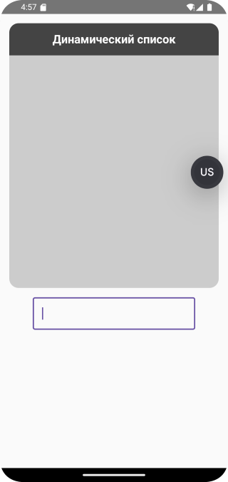
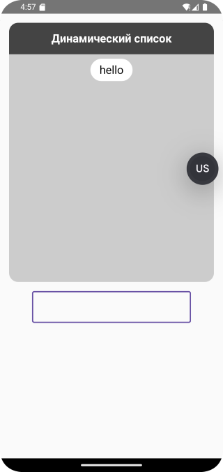
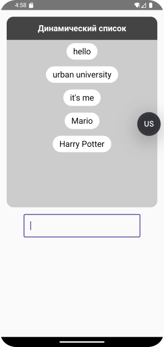

# Домашнее задание по теме "TextField"
## Приложение «Динамический список»

На основе пройденного материала необходимо написать приложение для вывода прокручиваемого динамического списка с возможностью добавлять и удалять элементы. Добавление элементов производится при помощи ввода текста в `OutlineTextField` по нажатию на Text “Добавить”.

Удаление элементов производится по нажатию на `Text item`’а в списке. Рекомпозиция компонентов должна происходить моментально.
При реализации списка необходимо использовать `ArrayList`.
Примерный вариант отображения содержимого может выглядеть так:

Приложение необходимо сохранить проектом в удаленном репозитории, для проверки качества предоставить ссылку преподавателю, либо сделать скрины эмулятора при каждом шаге работы приложения или снять видео экрана при работе приложения.

## Скриншоты домашнего задания

 Скриншоты здесь 

